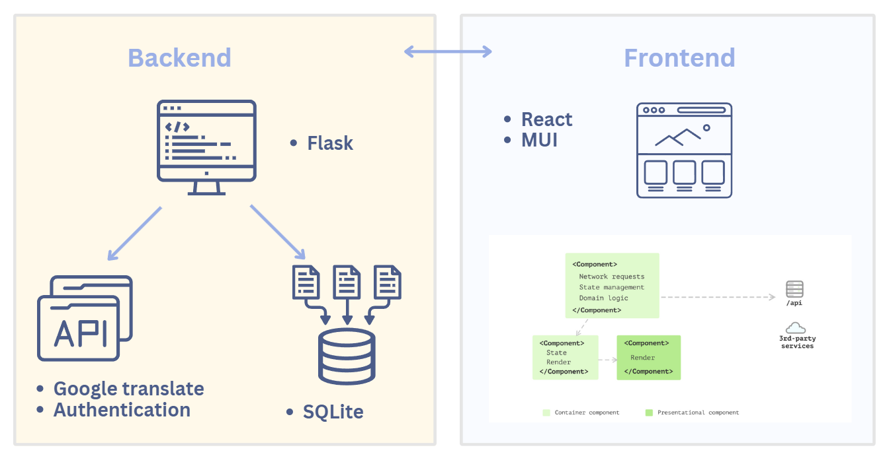

Architecture
============

The architecture of the system is as follows:

Frontend
------

The frontend is built using React, a popular JavaScript library for building user interfaces. React allows developers to build reusable UI components and manage the state of the application using Redux, a state management library. 

UI
~~~~~~~~~~~

The frontend is also built using Material-UI (MUI), a popular React UI framework that provides a set of pre-built components that can be used to build a responsive and modern user interface.

Components
~~~~~~~~~~~
The architecture of the frontend components is as follows:

For details about the components used in the frontend, please refer to the :doc:`components` section.

Backend
-------

The backend is built using Python Flask. It is responsible for handling API requests and returning responses to the frontend. The backend uses SQLite as the database to store user data and other information.

Database
~~~~~~~~~~~

The database is built using SQLite for its lightweight, serverless, and file-based architecture, making it ideal for development and small-scale applications. To enhance database management, we adopted SQLAlchemy as our ORM, enabling Pythonic interaction with the database. This combination ensures a robust, maintainable, and scalable data management solution.

API
~~~~~~~~~~~

The system provides RESTful APIs for the frontend to interact with the backend. The APIs are built using Express and are responsible for handling API requests and returning responses to the frontend. The APIs are secured using JWT (JSON Web Tokens) for authentication and authorization.

For details about the api used in the backend, please refer to the :doc:`api` section.

File System
~~~~~~~~~~~
All output files will be organized in a structure following **root_directory - benchmark - model - language**. 

Synchronizes the database with the directory structure by generating an index of tasks, benchmarks, models, 
and available language data. 

The function ``generate_index_json(root_dir)`` in ``app.py`` scans a specified root directory and saves the structure to ``tasks.json`` file.

.. function:: generate_index_json(root_dir)

   :param root_dir: The root directory containing benchmark subdirectories.
   :type root_dir: str
   :returns: None (Writes output to a JSON file)
   :rtype: None

.. note:: Each **task type** and its corresponding **benchmarks** are predefined in ``TASK_BENCHMARK_MAP``.

**Example Usage:**

.. code-block:: python

  generate_index_json("/path/to/root_directory")

**JSON Output Structure Example:**

.. code-block:: json

  {
      "text_classification": {
          "benchmark1": {
              "model1": ["language1", "language2",...],
              "model2": ["language1",...]
              ...
          },
          "benchmark2": {
              "model3": ["language3", "language4"]
              ...
          }
          ...
      },
      "translation": {
          "benchmarkX": {
              "modelA": ["EN-language5", "EN-language6"],
              "modelB": ["language7-EN"]
              ...
          }
          ...
      }
      ...
  }