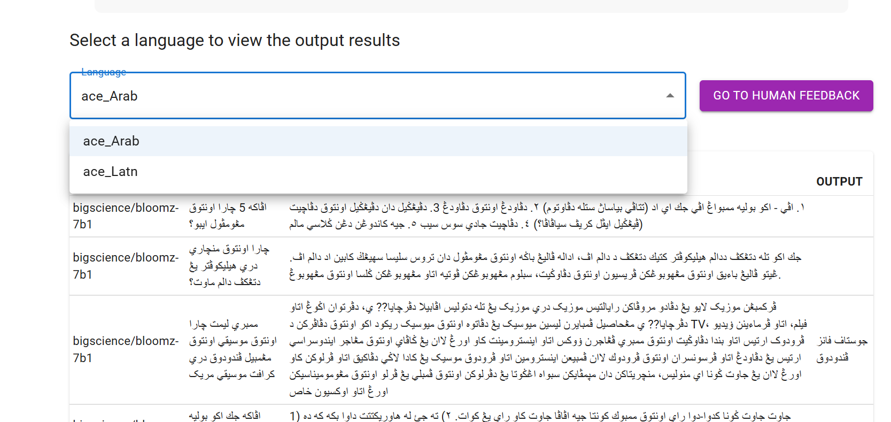
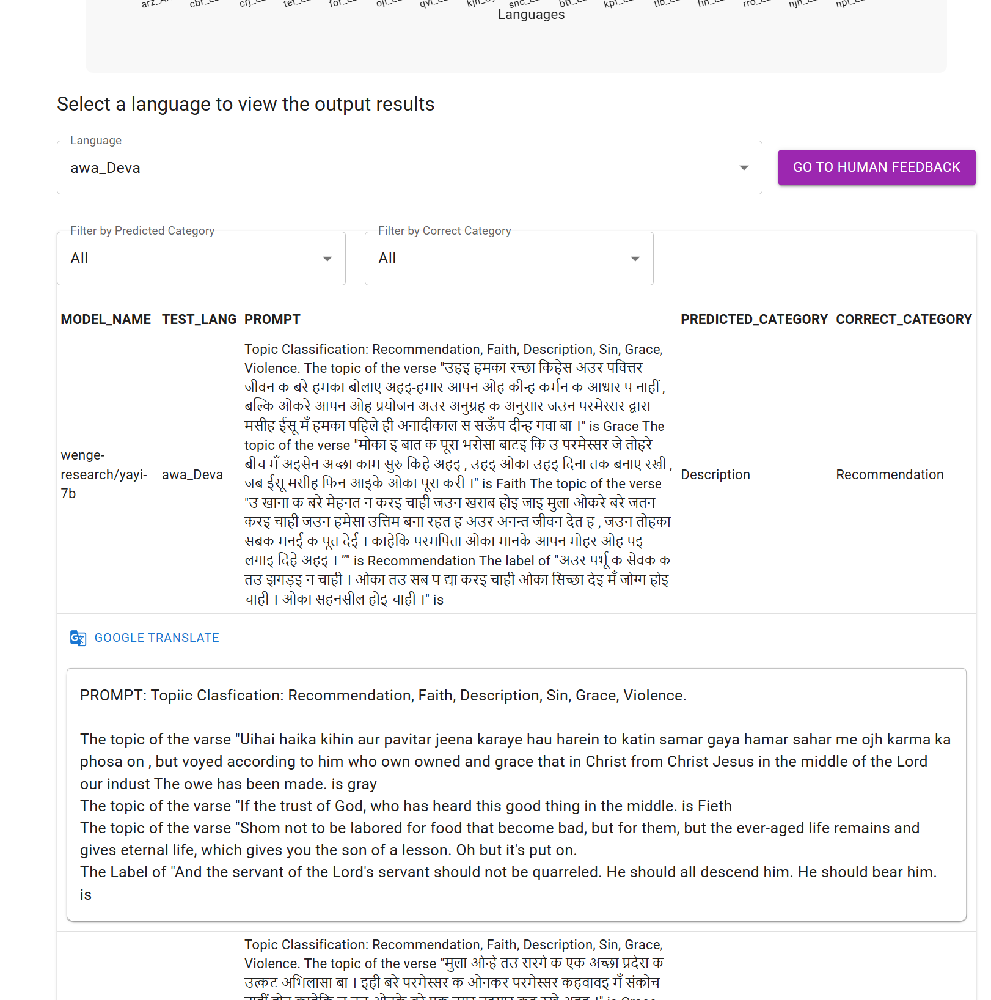
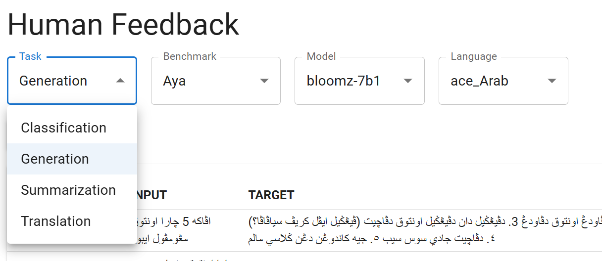
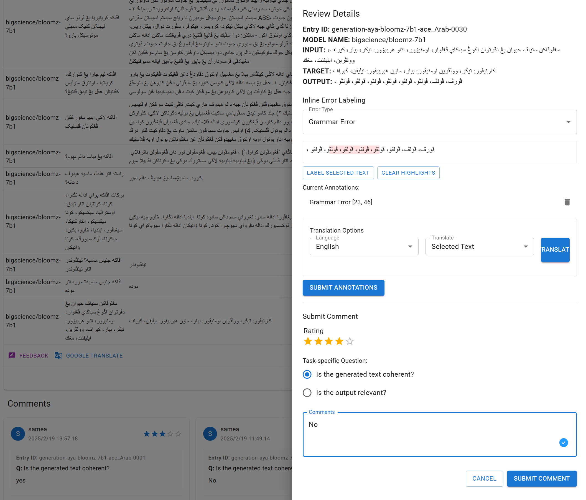
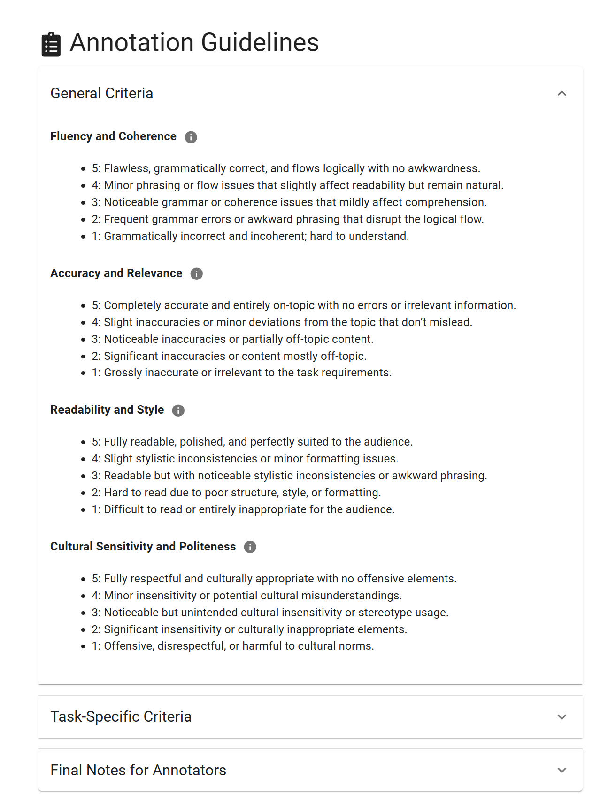

Features
========
Data Visualization
------------------
Data charts
~~~~~~~~~~~~~~~

Comparative metrics
~~~~~~~~~~~~~~~~~~~~~~

Output Section
~~~~~~~~~~~~~~
Under the language comparison results chart, there is a section that displays **specific output results**.
Selecting a language will reveal all corresponding output results.

By clicking the **"GO TO HUMAN FEEDBACK" button**, you will be redirected to the corresponding human feedback page. 
If no language is selected, a prompt will appear reminding you to choose a language first.

.. note:: The section will only be displayed when the filter type is set to model in the previous step.

Translation and Filters
~~~~~~~~~~~~~~~~~~~~~~
It provides filters and translation functions to assist in result analysis.

- **Translation** - Upon clicking the translation button, the translated text by  Google Translation will be displayed. If no language is detected, a prompt will appear to alert the user.
- **Catergory Filters** - For *classification tasks*, filters for both predicted category and correct category will be provided to facilitate the examination of results.
  

Human Evaluation
------------------
Task seletion
~~~~~~~~~~~~
In the human feedback options, sequentially select the **task type**, **benchmark**, **model**, and **language**, and the corresponding output results will be displayed.

Feedback sidebar
~~~~~~~~~~~~~~~~~~
Clicking on a row will expand it, revealing a feedback button and a translation button within the expanded row.
Clicking the feedback button will cause a feedback sidebar to appear on the right side.

.. note:: The sidebar will only pop up when the user is logged in; otherwise, a login reminder will be displayed.

The feedback sidebar allows users to provide feedback on the model's predictions. 
It includes a text box for users to enter their feedback and a button to submit the feedback. 
The feedback will be stored in the database and can be accessed later for further analysis.

Highlighter
~~~~~~~~~~~~

Guidelines
~~~~~~~~~~~~

